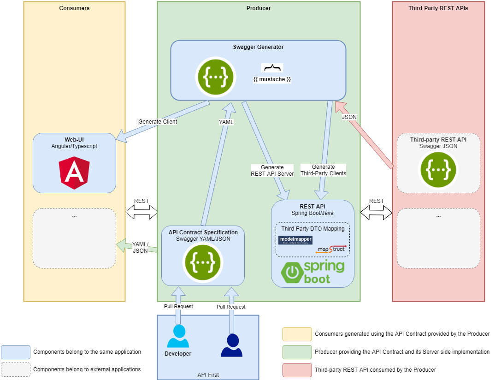

# Architecture

Architecture for the API First approach with Swagger.

# Build and Run

## REST API with Web UI

In the project root directory execute:

`gradlew bootRun`

* Web UI is served at http://localhost:8081
* Swagger UI is served at http://localhost:8081/swagger-ui.html

## Web UI with Auto Reload

In the project root directory execute:

`gradlew serveWebUI`

It should automatically open http://localhost:4200 in the default web browser.
